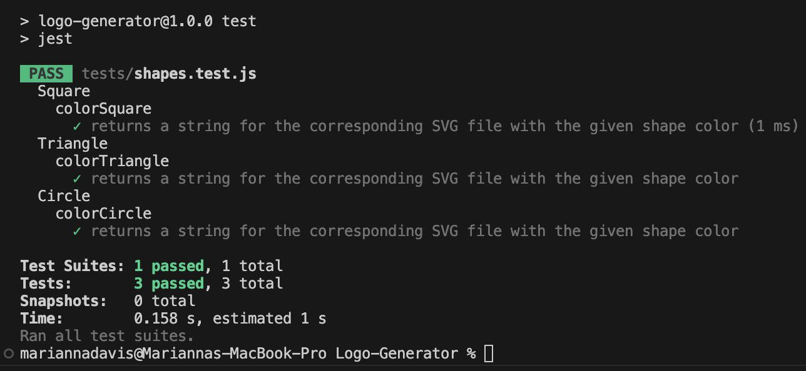

 
# Logo-Generator 
## Description 
  As a web developer, I want to follow prompts to generate a simple logo for my projects so that I do not have to pay a graphic designer. 
## Table of Contents
[Installation](#installation) 

[Usage](#usage)

[License](#license)

[Credits](#credits)

[Questions](#questions)

## Installation 
  Clone the repository and type node index.js in the terminal and follow the prompts.
## Usage 
  Enter up to three characters, a text color, shape color, and shape.  Ex: SVG, blue, yellow, triangle
## Credits 
  Thank you to the AskBCS team. Thank you, Thomas Calle and Shabab Chowdhury for the youtube tutorials
## License
  mit
      [License](https://choosealicense.com/licenses/mit/)
## Questions
Check out my GitHub at https://github.com/marbfree 

Clone the repository at https://github.com/marbfree/Logo-Generator

